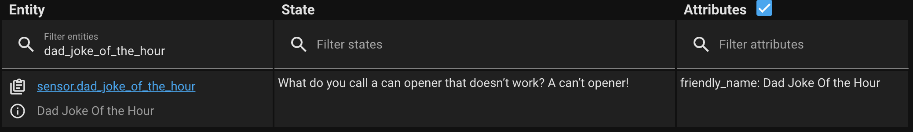

# Home Assistant Templating and integrations to have some fun with your briefing

[Back to README](./README.md)  

I wanted to add some fun things to the Announcement, So I went in search of different ways to do that.
I landed on adding:

- A random quote
- a random fact  
and  
- a random Dad Joke

The first hurdle is getting the data into Home Assistant to then be able to use it in the templates.

Thankfully, I found a good source of all 3 available via REST API's, all from [API Ninjas](https://api-ninjas.com)
The API documentations are:
- [Dad Jokes](https://api-ninjas.com/api/dadjokes)  
- [Random Facts](https://api-ninjas.com/api/facts)  
- [Random Quotes](https://api-ninjas.com/api/quotes)  

There's plenty more API's that might be useful so I recommend checking out API Ninjas. You'll need to sign up for an API Key, but it's free.  

## Restful Sensor integration
So to get the data into Home Assistant, we're going to use the RESTful Sensor integration, this involves modifying your `configuration.yaml` file.  

I also make use of the `secrets.yaml` file to store the APINinjas API key.

your secrets.yaml file entry should look like this:
```
ninjas_api: <YOUR_API_KEY>
```
obviously substituting `<YOUR_API_KEY>` for the API Key you were issued by API Ninjas.
### Pro-Tip
After Logging into API Ninjas website, you'll find your API Key at:  
### My Account,
### API Statistics
and
### Show API Key

## The Home Assistant RestFul API Setups


### __Quote "sensor"__

The `configuration.yaml` entry I came up with for the Quote Sensor looks like this

```
sensor:
  - platform: rest
    name: Quote Sensor
    unique_id: quote_sensor
    resource: https://api.api-ninjas.com/v1/quotes?
    method: GET
    scan_interval: 7200
    headers:
      X-Api-Key: !secret ninjas_api
    value_template: "{{ value_json[0].quote }}"
    json_attributes_path: "$.[0]"
    json_attributes:
      - "author"
      - "category"
```

This creates a Sensor entity in Home Assistant with the "State" being the Quote, and attributes with the Author and the category.  


This becomes important when we get to the Announcement

### __Dad Joke__

For the Dad Joke, we don't really need any other attributes, so the code is a bit simpler


```
sensor:
  - platform: rest
    name: Dad Joke Of the Hour
    unique_id: dad_joke
    resource: https://api.api-ninjas.com/v1/dadjokes?limit=1
    method: GET
    scan_interval: 7200
    headers:
      X-Api-Key: !secret ninjas_api
    value_template: "{{ value_json[0].joke }}"
```
Which creates a Sensor entity with the Dad Joke as it's State


### __Random Fact__

And again, very simple for the Random Fact

```
sensor:
  - platform: rest
    name: Random Fact
    unique_id: random_fact
    resource: https://api.api-ninjas.com/v1/facts?limit=1
    method: GET
    scan_interval: 7200
    headers:
      X-Api-Key: !secret ninjas_api
    value_template: "{{ value_json.articles[0].title }}"
```


## Announcing Jokes, facts, and quotes


### Starting with the Quote
So for the quote, I want to know the "Category" of quote.  
There's a list of categories in the [API Documentation](https://api-ninjas.com/api/quotes).  
Expect results like:
- `marriage`
- `government`
- `age`
- `movies`  

so that line of code looks like this:  
```
The {{ state_attr( 'sensor.quote_sensor', 'category' ) }} Quote of the day is
```
I also want to know who said it:
```
by {{ state_attr( 'sensor.quote_sensor', 'author' ) }}.
```
And lastly, obviously, the quote:
```
They said. {{ states('sensor.quote_sensor') }}
```
Put altogether, it looks like this.
```
The {{ state_attr( 'sensor.quote_sensor', 'category' ) }} Quote of the day is by {{ state_attr( 'sensor.quote_sensor', 'author' ) }}. 
They said. {{ states('sensor.quote_sensor') }}
```

### Now for a Dad Joke

This one is easy. We only need the state of the sensor entity we created:

```
Here is a Dad Joke.. {{ states('sensor.dad_joke_of_the_hour') }}
```
The double stop in the template here adds an additional slight pause to the end of "Here is a Dad Joke". It just seemed to flow better out of the Text To Speech that way

### Lastly, our Random Fact

Again, very simple, only needing to read the State of our Random Fact Entity.
```
And a random fact.. {{ states('sensor.random_fact') }}
```
Again, the double stop seemed to make the timeing better.

### Put All Together
```
The {{ state_attr( 'sensor.quote_sensor', 'category' ) }} Quote of the day is by {{ state_attr( 'sensor.quote_sensor', 'author' ) }}. 
They said. {{ states('sensor.quote_sensor') }}

Here is a Dad Joke.. {{ states('sensor.dad_joke_of_the_hour') }}

And a random fact.. {{ states('sensor.random_fact') }}
```
