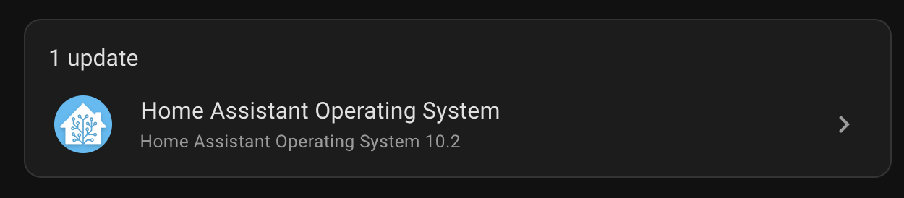

# Home Assistant Pending Updates Announcement

[Back to README](./README.md)  

I also wanted The Briefing to announce if there's any pending Home Assistant updates to be installed, but I want to limit it down to only the Home Assistant Core, Home Assistant OS, and ESPHome.



So I came up with the following Template

In hindsight, I should probably put this into a for loop.
I'll do that for version 2 maybe....

### The Template
```jinja

There's a Home Assistant O S Update pending. 
The Installed version is {{ state_attr('update.home_assistant_operating_system_update', 'installed_version') }} 
The Available version is {{ state_attr('update.home_assistant_operating_system_update', 'latest_version') }} 



There's a Home Assistant Core Update pending. 
The Installed version is {{ state_attr('update.home_assistant_core_update', 'installed_version') }} 
The Available version is {{ state_attr('update.home_assistant_core_update', 'latest_version') }} 


 
There's an E S P Home Update pending. 
The Installed version is {{ state_attr('update.esphome_update', 'installed_version') }} 
The Available version is {{ state_attr('update.esphome_update', 'latest_version') }} 

```
### A Better Way
Let's try doing this with an Array instead

```jinja





  
  There's a {{ name }} pending. 
  The Installed version is {{ state_attr( entity, 'installed_version') }} 
  The Available version is {{ state_attr(entity, 'latest_version') }} 
  

```
This way, we can easily add or remove "Update" entity dictionaries to the `entities` array.  
The `entity_id` is the "Key" of the dictionary, and we put a "Text to Speech" Compatible name in the Value.


### The Home Assistant Script
Here's the script I put into my `scripts.yaml` or you can just paste it into the Home Assistant UI when editing the script in YAML mode.
```yaml
alias: Announce Pending Updates
sequence:
  - service: notify.alexa_media
    data:
      message: >-
        

        
          
          There's a {{ name }} pending. 
          The Installed version is {{ state_attr( entity, 'installed_version') }} 
          The Available version is {{ state_attr(entity, 'latest_version') }} 
          
        
      target:
        - media_player.dining_room_echo_plus
mode: single
icon: mdi:update
```
